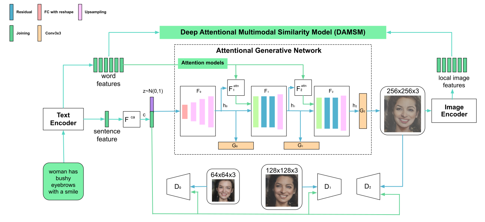

# Text To Face Using AttnGAN [](https://www.python.org/downloads/release/python-360/) [](https://www.python.org/downloads/release/python-360/)
## Getting Started
1. [Overview][overview]
1. [Installations](#installations)
1. [Training](#training)
1. [Run](run)
1. [Validation](#validation)
1. [Credits](#credits)

## [Overview](#overview)
Pytorch implementation for reproducing Text to Face (T2F) using AttnGAN results from our paper [Development and Deployment of a Generative Model-Based Framework for Text to Photorealistic Image Generation](https://www.sciencedirect.com/science/article/abs/pii/S092523122101239X "Paper").




## [Installations](#installations)

### Dependencies 
- [](https://www.python.org/downloads/release/python-360/)
- [](https://anaconda.org/pytorch/pytorch)

In addition, please add the project folder to PYTHONPATH and `pip install` the following packages:
- `python-dateutil`
- `easydict`
- `pandas`
- `torchfile`
- `nltk`
- `scikit-image`

### Data

1. Download our preprocessed metadata for [birds](https://drive.google.com/open?id=1O_LtUP9sch09QH3s_EBAgLEctBQ5JBSJ) & [CelebA](#) and save them to `data/`
2. Download the [birds](http://www.vision.caltech.edu/visipedia/CUB-200-2011.html) image data. Extract them to `data/birds/`
3. For faces download [CelebA](#) dataset and extract the images to `data/face/`

## [Training](#training)

- Pre-train DAMSM models:
  - For bird dataset: `python pretrain_DAMSM.py --cfg cfg/DAMSM/bird.yml --gpu 0`
  - For face dataset: `python pretrain_DAMSM.py --cfg cfg/DAMSM/face.yml --gpu 1`
 
- Train AttnGAN models:
  - For birds dataset: `python main.py --cfg cfg/bird_attn2.yml --gpu 2`
  - For CelebA dataset: `python main.py --cfg cfg/face_attn2.yml --gpu 3`

- `*.yml` files are example configuration files for training/evaluation our models.


**Pretrained Model**
- [DAMSM for bird](https://drive.google.com/open?id=1GNUKjVeyWYBJ8hEU-yrfYQpDOkxEyP3V). Download and save it to `DAMSMencoders/`
- [DAMSM for CelebA](#). Download and save it to `DAMSMencoders/`
- [AttnGAN for bird](https://drive.google.com/open?id=1lqNG75suOuR_8gjoEPYNp8VyT_ufPPig). Download and save it to `models/`
- [AttnGAN for CelebA](#). Download and save it to `models/`
- [AttnDCGAN for bird](https://drive.google.com/open?id=19TG0JUoXurxsmZLaJ82Yo6O0UJ6aDBpg). Download and save it to `models/`
  - This is an variant of AttnGAN which applies the propsoed attention mechanisms to DCGAN framework. 

## [Sampling](#run)
- Run `python main.py --cfg cfg/eval_bird.yml --gpu 1` to generate examples from captions in files listed in "./data/birds/example_filenames.txt". Results are saved to `DAMSMencoders/`. 
- Change the `eval_*.yml` files to generate images from other pre-trained models. 
- Input your own sentence in "./data/birds/example_captions.txt" if you wannt to generate images from customized sentences. 

## [Validation](#validation)
- To generate images for all captions in the validation dataset, change B_VALIDATION to True in the eval_*.yml. and then run `python main.py --cfg cfg/eval_bird.yml --gpu 1`
- We compute FID score for models trained on CelebA using [#](https://#).


**Examples generated by AttnGAN [[Blog]](https://blogs.microsoft.com/ai/drawing-ai/)**

 bird example              |  CelebA example
:-------------------------:|:-------------------------:
  |  


**Creating an API**
[Evaluation code](eval) embedded into a callable containerized API is included in the `eval\` folder.

## [Credits](#credits)

### Citing
If you find Text to Face (T2F) using AttnGAN useful in your research, please consider citing:

#### Text To Face using AttnGAN
```
@article{Tao18attngan,
  author    = {Tao Xu, Pengchuan Zhang, Qiuyuan Huang, Han Zhang, Zhe Gan, Xiaolei Huang, Xiaodong He},
  title     = {Development & Implementation (Deployment) of a Generative Model-Based Framework for Photorealistic},
  Year = {2018},
  booktitle = {{CVPR}}
}
```
#### AttnGAN
```
@article{Tao18attngan,
  author    = {Tao Xu, Pengchuan Zhang, Qiuyuan Huang, Han Zhang, Zhe Gan, Xiaolei Huang, Xiaodong He},
  title     = {AttnGAN: Fine-Grained Text to Image Generation with Attentional Generative Adversarial Networks},
  Year = {2018},
  booktitle = {{CVPR}}
}
```

### Reference

- [AttnGAN: Fine-Grained Text to Image Generation with Attentional Generative Adversarial Networks](http://openaccess.thecvf.com/content_cvpr_2018/papers/Xu_AttnGAN_Fine-Grained_Text_CVPR_2018_paper.pdf) by Tao Xu, Pengchuan Zhang, Qiuyuan Huang, Han Zhang, Zhe Gan, Xiaolei Huang, Xiaodong He. (This work was performed when Tao was an intern with Microsoft Research.
- [StackGAN++: Realistic Image Synthesis with Stacked Generative Adversarial Networks](https://arxiv.org/abs/1710.10916) [[code]](https://github.com/hanzhanggit/StackGAN-v2)
- [Unsupervised Representation Learning with Deep Convolutional Generative Adversarial Networks](https://arxiv.org/abs/1511.06434) [[code]](https://github.com/carpedm20/DCGAN-tensorflow)

[overview]: #overview "Overview"
